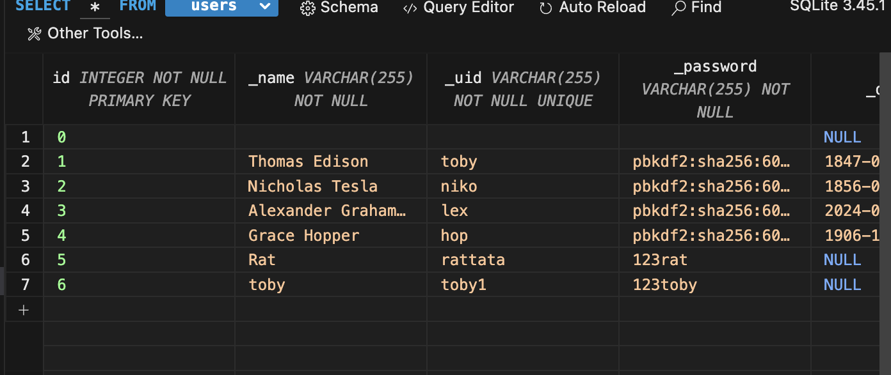

### Project Summary
A website with a travel theme where the user can play different games, learning more about different parts of the world. This challenged me and my group to figure out how to connect the database stored in the backend to create functions on our website.

### Feature
User login and signup page which leads to the hompage that gateways to different games

### College Board Requirements
Instructions for input from one of the following: the user, a device, an online datas stream, a file.
- The Signup and Login page require the user to input their name, username, password, and date of birth

Use of at least one list (or other collection type) to represent a collection of data that is stored and used to manage program complexity and help fulfill the users purpose.
- The data from the user is stored into the sqlite data table, where you can see all the users created and the information

At least one procedure that contributed to the program's intended purpose where you have defined: the name, return type, one or more parameters.